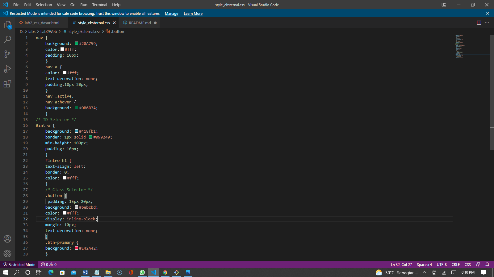
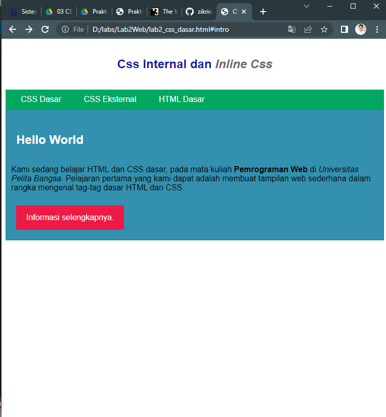
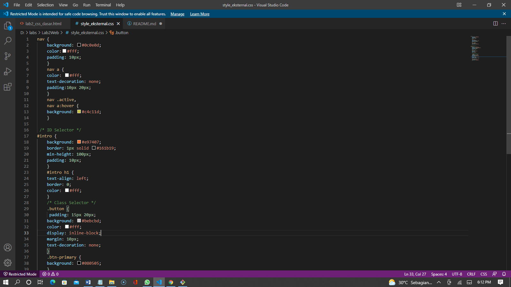
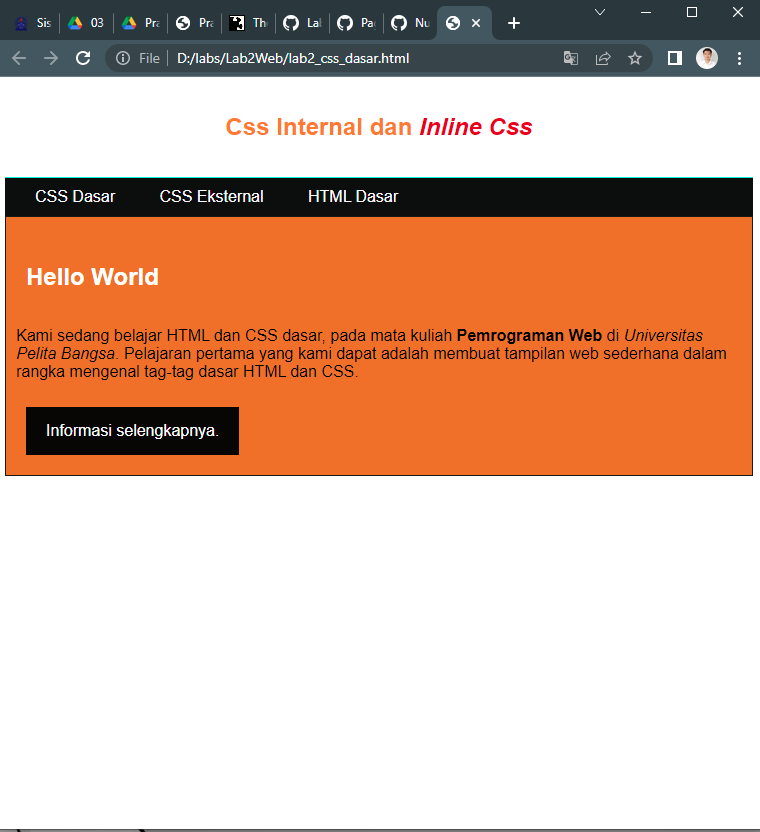

# Pertanyaan

1. Lakukan eksperimen dengan mengubah dan menambah properti dan nilai pada kode CSS dengan mengacu pada CSS Cheat Sheet yang diberikan pada file terpisah dari modul ini.
2. Apa perbedaan pendeklarasian CSS elemen h1 {...} dengan #intro h1 {...}? berikan penjelasannya!
3. Apabila ada deklarasi CSS secara internal, lalu ditambahkan CSS eksternal dan inline CSS pada elemen yang sama. Deklarasi manakah yang akan ditampilkan pada browser? Berikan penjelasan dan contohnya!

4. Pada sebuah elemen HTML terdapat ID dan Class, apabila masing-masing selector tersebut terdapat deklarasi CSS, maka deklarasi manakah yang akan ditampilkan pada browser? Berikan penjelasan dan contohnya!

# Jawaban

1. sebelum dirubah :

tampilan dibrowser :

sesudah dirubah :

tampilan dibrowser :

2. => Kalau h1{...} Untuk memberikan style pada semua element h1

=> Kalau #intro h1{...} Awalan simbol hash (#) memungkinkan kita untuk memberi style pada id. selector id bersifat kaku dan tidak bisa digunakan kembali pada element yang lainnya. Menurut saya lebih baik gunakan selektor class untuk mendefinisikan element yang ingin diberi nilai.